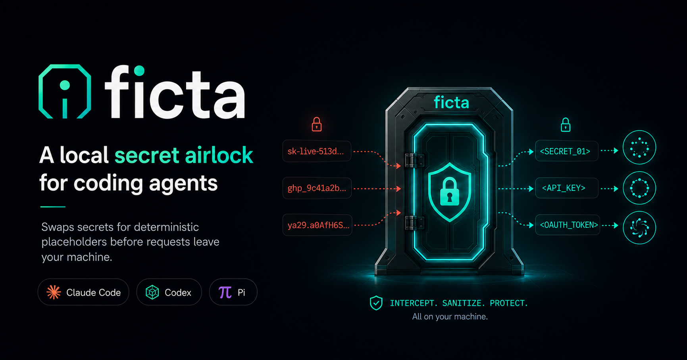

# ficta

ficta sits between your coding agent and the model provider. It replaces the secret values you
already manage in `.env`, process env, or Doppler with deterministic placeholders before model
requests leave your machine, then restores the real values locally so your agent can still edit
files and run commands normally.

If a protected value would be sent verbatim in a surface ficta redacts, ficta blocks the request
instead of forwarding it. The exact boundary and deliberate exceptions are scoped in the
[threat model](packages/ficta/docs/threat-model.md).

## Who it's for

Individual developers using the coding agents ficta supports today — **Claude Code**, **Codex**, and
**Pi** — who do not want real keys copied into provider request logs or long-lived model context.

ficta is personal secret-hygiene tooling. It is **not** enterprise DLP, a compliance product, or a
sandbox.

## Quick start

```sh
npm install -g @steflsd/ficta@beta
# or: pnpm add -g @steflsd/ficta@beta  /  bun install --global @steflsd/ficta@beta
```

```sh
ficta setup              # configure ~/.ficta/config.toml; optionally install shims
ficta doctor claude      # or: codex / pi
# restart your shell if setup installed shims
claude                   # now runs through ficta
```

No shim install:

```sh
ficta claude             # or: ficta codex / ficta pi
```

Full install and usage docs live in the package README:
**[`packages/ficta/README.md`](packages/ficta/README.md)**.

## What ficta protects

ficta's exact guarantee is intentionally narrow:

- protects **registered values in their verbatim form** after registry filters and exclusions;
- redacts covered request bodies, query strings, and non-auth headers;
- fail-closes if a protected value survives redaction in a surface ficta is supposed to redact;
- restores placeholders locally on model responses.

By default, ficta discovers values from `.env` / `.env.local`, Doppler's current config (when the
Doppler CLI is available), and secret-ish process env names such as `KEY`, `TOKEN`, `SECRET`,
`PASSWORD`, `AWS`, `OPENAI`, etc.

### What it does not protect

ficta does not claim full prompt privacy or full DLP coverage. Out of scope: unregistered or
transformed values (base64/URL-encoded/split secrets), secrets the agent sends itself through tool
execution / `curl` / MCP tools, binary responses, and arbitrary non-model network egress. See the
[threat model](packages/ficta/docs/threat-model.md) for the full boundary.

## Supported agents

| Agent | Status | Notes |
| --- | --- | --- |
| Claude Code | Verified | Uses Anthropic base URL routing. |
| Codex | Verified | Supports API-key and ChatGPT/OAuth flows. |
| Pi | Verified | Routes built-in `anthropic`/`openai`/`openai-codex` providers via an ephemeral `PI_CODING_AGENT_DIR` + `models.json` base-URL override. |

ficta only supports CLI agents that route **all** of their model traffic through its proxy. **IDE
clients such as Cursor are not supported** — their agentic features bypass a custom base URL, so
secrets could reach the provider unredacted. See the
[threat model](packages/ficta/docs/threat-model.md#ide-clients-cursor-etc).

## What's in this repo

This is a monorepo. The published product is the `ficta` package; the web app is a supporting demo.

- **[`packages/ficta`](packages/ficta)** — [`@steflsd/ficta`](https://www.npmjs.com/package/@steflsd/ficta),
  the CLI and redaction proxy. This is the product published to npm.
- **[`apps/web`](apps/web)** — an internal chat UI that routes every model call through the ficta
  proxy so secrets are tokenized before the vendor and restored on the way back. Private, not
  published.

## Documentation

- [`packages/ficta/README.md`](packages/ficta/README.md) — full install, usage, and commands
- [`docs/install.md`](packages/ficta/docs/install.md) — shim installation and runtime behavior
- [`docs/threat-model.md`](packages/ficta/docs/threat-model.md) — exact promise, covered surfaces, and non-goals
- [`docs/plugins.md`](packages/ficta/docs/plugins.md) — registry-source and agent-integration plugins
- [`docs/exfil-and-egress.md`](packages/ficta/docs/exfil-and-egress.md) — why tool-channel egress is out of scope
- [`docs/codex-oauth-intercept.md`](packages/ficta/docs/codex-oauth-intercept.md) — Codex ChatGPT/OAuth routing
- [`docs/benchmarks.md`](packages/ficta/docs/benchmarks.md) — performance notes
- [`CONTRIBUTING.md`](packages/ficta/CONTRIBUTING.md) — contributing to core and extension seams
- [`SECURITY.md`](packages/ficta/SECURITY.md) — reporting vulnerabilities and expected limitations

## Status

ficta is pre-1.0 beta software. The core redaction, restore, and fail-closed behavior is covered by
tests and local agent runs, but early users should run `ficta doctor <agent>` before relying on it.

## Development

```sh
pnpm install
pnpm dev         # proxy + web; auto-uses Doppler when configured, otherwise local .env
pnpm dev:proxy   # proxy only
pnpm web:dev     # web UI only
pnpm check       # biome
pnpm typecheck
pnpm test
pnpm build
```

`pnpm dev` is for developing the proxy + web UI together. The coding agents don't use it — `ficta
claude|codex|pi` starts its own ephemeral proxy per launch (see
[`docs/install.md`](packages/ficta/docs/install.md)).

## License

MIT — see [`LICENSE`](packages/ficta/LICENSE).
